# Functions Mermaid Diagram

The following diagram shows the first few layers deep (breadth-first) of functions that are invoked by the main function loop.

Functions with an orange border come from the `janet-termios` library.

```mermaid
%% Top Node 
graph LR

%% Style Classes
classDef violet stroke:#862e9c
classDef purple stroke:#5f3dc4
classDef indigo stroke:#364fc7
classDef blue stroke:#1864ab

classDef orange stroke:#e67700

%% Functions
%% idt(janet-termios)
    idt.1(enable-raw-mode):::orange
    idt.2(read-key):::orange
    idt.3(disable-raw-mode):::orange
    idt.4(get-window-size):::orange

id1(main)
    id1.1(init):::violet
        %% idt.1(enable-raw-mode)
        id1.1.1(reset-editor-state):::violet
            %% idt.4(get-window-size):::violet
        id1.1.2(editor-open):::violet
    
    id1.2(editor-refresh-screen):::purple
        id1.2.1(update-screen-sizes):::purple
        id1.2.2(editor-scroll):::purple
        id1.2.3(editor-update-rows):::purple
            id1.2.3.1(render-tabs):::purple
            id1.2.3.2(slice-rows):::purple
            id1.2.3.3(apply-h-scroll):::purple
            id1.2.3.4(trim-to-width):::purple
            id1.2.3.5(add-syntax-hl):::purple
            id1.2.3.6(add-search-hl):::purple
            id1.2.3.7(add-select-hl):::purple
            id1.2.3.8(fill-empty-rows):::purple
            id1.2.3.9(add-welcome-message):::purple
            id1.2.3.10(apply-margin):::purple
            id1.2.3.11(add-status-bar):::purple
            id1.2.3.12(join-rows):::purple
        id1.2.4(get-margin):::purple
    id1.3(editor-process-keypress):::indigo
        %% idt2(read-key):::indigo
        id1.3.1{{keymap}}:::indigo
            id1.3.1.1(ctrl-key functions):::indigo
                id1.3.1.1.1(close-file):::indigo
                id1.3.1.1.2(toggle-line-numbers):::indigo
                id1.3.1.1.3(load-file-modal):::indigo
                id1.3.1.1.4(save-file):::indigo
                id1.3.1.1.5(save-file-as):::indigo
                id1.3.1.1.6(enter-debugger):::indigo
                id1.3.1.1.7(close-file):::indigo
                id1.3.1.1.8(find-in-text-modal):::indigo
                id1.3.1.1.9(jump-to-modal):::indigo
                id1.3.1.1.10(undo):::indigo
                id1.3.1.1.11(redo):::indigo
                id1.3.1.1.12("copy-to-clipboard (copy"):::indigo
                id1.3.1.1.13("copy-to-clipboard (cut)"):::indigo
                id1.3.1.1.14(paste-clipboard):::indigo
                id1.3.1.1.15(paste-clipboard):::indigo
            id1.3.1.2(:page-up):::indigo
            id1.3.1.3(:page-down):::indigo
            id1.3.1.4(:home):::indigo
            id1.3.1.5(:end):::indigo
            id1.3.1.6(:tab):::indigo
            id1.3.1.7(:leftarrow):::indigo
            id1.3.1.8(:rightarrow):::indigo
            id1.3.1.9(:uparrow):::indigo
            id1.3.1.10(:downarrow):::indigo
            id1.3.1.11(:ctrluparrow):::indigo
            id1.3.1.12(:ctrldownarrow):::indigo
            id1.3.1.13(:shiftleftarrow):::indigo
            id1.3.1.14(:shiftrightarrow):::indigo
            id1.3.1.15(:shiftuparrow):::indigo
            id1.3.1.16(:shiftdownarrow):::indigo
            id1.3.1.17(:shiftdel):::indigo
            id1.3.1.18(:enter):::indigo
            id1.3.1.19(:esc):::indigo
            id1.3.1.20(:backspace):::indigo
            id1.3.1.21(:del):::indigo
        id1.3.2(editor-handletyping):::indigo
    
    id1.4(exit):::blue
        %% idt.3(disable-raw-mode)
        
%% Connections
%% idt.4 & idt.1 & idt.2 & idt.3 --> idt
id1 --> id1.1 & id1.2 & id1.3 & id1.4
    id1.1 --> idt.1 & id1.1.1 & id1.1.2
        id1.1.1 --> idt.4
    subgraph while
        id1.2 --> id1.2.1 & id1.2.2 & id1.2.3 & id1.2.4
            id1.2.3 --> id1.2.3.1 & id1.2.3.2 & id1.2.3.3 & id1.2.3.4 & id1.2.3.5 & id1.2.3.6 & id1.2.3.7 & id1.2.3.8 & id1.2.3.9 & id1.2.3.10 & id1.2.3.11 & id1.2.3.12
        id1.3 --> idt.2 & id1.3.1 & id1.3.2
            id1.3.1 --> id1.3.1.1 & id1.3.1.2 & id1.3.1.3 & id1.3.1.4 & id1.3.1.5 & id1.3.1.6 & id1.3.1.7 & id1.3.1.8 & id1.3.1.9 & id1.3.1.10 & id1.3.1.11 & id1.3.1.12 & id1.3.1.13 & id1.3.1.14 & id1.3.1.15 & id1.3.1.16 & id1.3.1.17 & id1.3.1.18 & id1.3.1.19 & id1.3.1.20 & id1.3.1.21 
                id1.3.1.1 --> id1.3.1.1.1 & id1.3.1.1.2 & id1.3.1.1.3 & id1.3.1.1.4 & id1.3.1.1.5 & id1.3.1.1.6 & id1.3.1.1.7 & id1.3.1.1.8 & id1.3.1.1.9 & id1.3.1.1.10 & id1.3.1.1.11 & id1.3.1.1.12 & id1.3.1.1.13 & id1.3.1.1.14 & id1.3.1.1.15
    end
    id1.4 --> idt.3

```

